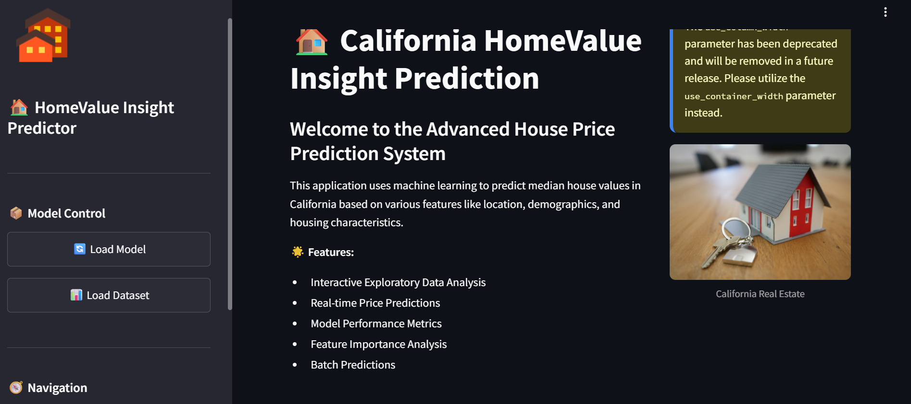
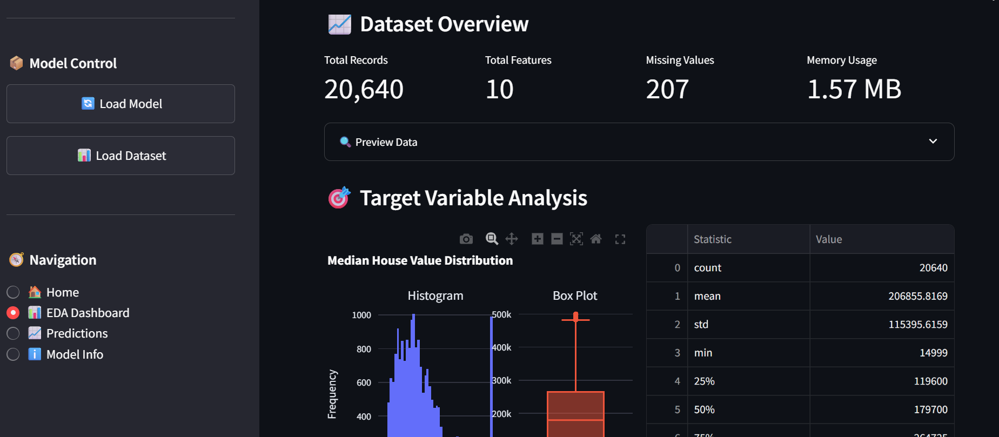
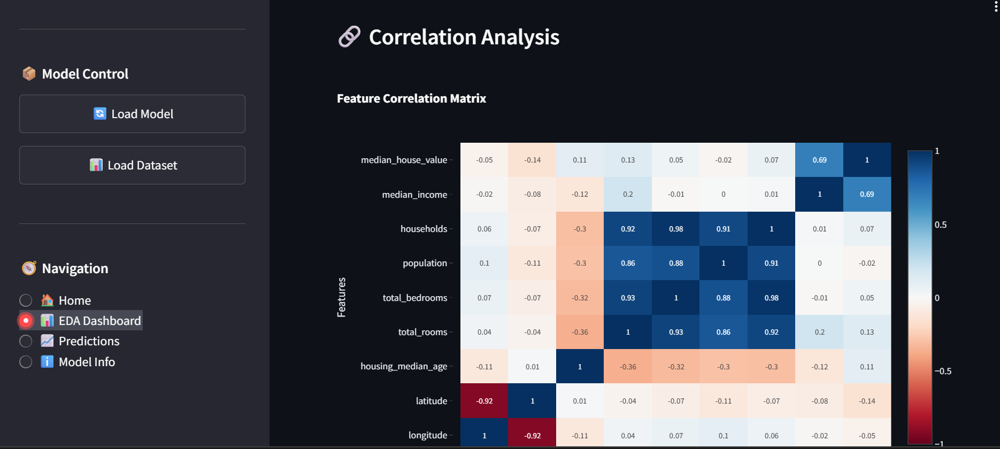
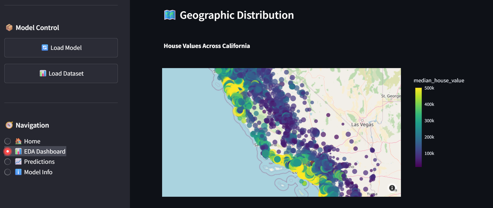
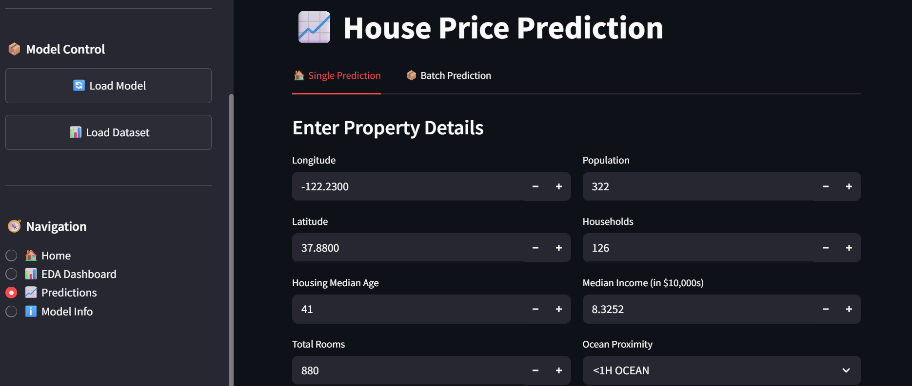
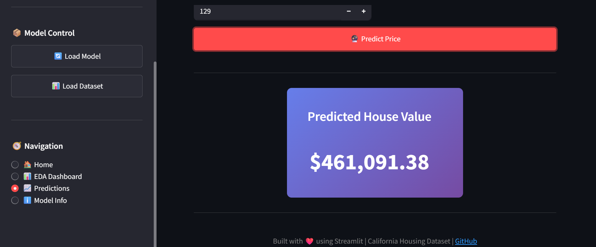
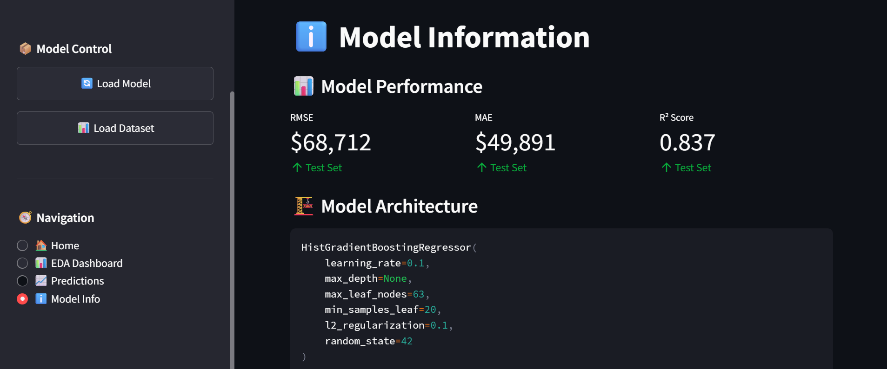

# 🏠 HomeValue Insight Predictor 
### Intelligent California House Price Prediction System

---

## 📌 Overview

HomeValue Insight Predictor is a production-ready machine learning application that predicts median house values in California using structured housing data.  

The project implements a complete ML lifecycle including:

- Data Cleaning & EDA
- Feature Engineering
- Preprocessing Pipelines
- Model Comparison & Cross-Validation
- Hyperparameter Tuning
- Deployment via Streamlit Dashboard

The application provides real-time predictions and interactive visual insights for better decision-making.

---

## 🎯 Problem Statement

Real estate pricing is influenced by multiple factors such as income levels, location, population density, and housing characteristics.  

This system eliminates manual estimation by leveraging Machine Learning models to accurately predict median house values based on block-level data.

---

## ✨ Key Features

- 📊 Interactive Exploratory Data Analysis Dashboard
- 🤖 Multiple Model Comparison (Linear, Ridge, Lasso, Random Forest, HistGradientBoosting)
- 🔍 Hyperparameter Tuning using GridSearchCV
- 📈 Performance Metrics (RMSE, MAE, R²)
- ⚡ Real-time Single & Batch Predictions
- 🌍 Geographic & Correlation Visualizations
- 🧠 Production-grade ML Pipeline with ColumnTransformer

---

## 🏗️ Project Architecture

Raw Data
↓
EDA & Cleaning
↓
Train-Test Split
↓
Preprocessing Pipeline
├── Numerical → Imputation + Scaling
└── Categorical → Imputation + OneHotEncoding
↓
Model Training
↓
Cross Validation
↓
Hyperparameter Tuning
↓
Final Model
↓
Streamlit Deployment

## 🧠 Models Used

- Linear Regression (Baseline)
- Ridge Regression
- Lasso Regression
- Random Forest Regressor
- HistGradientBoosting Regressor (Best Performing Model)

---

## 📊 Model Performance

| Metric | Description |
|--------|------------|
| RMSE | Root Mean Squared Error (Primary Metric) |
| MAE | Mean Absolute Error |
| R² Score | Variance Explained |

Best Model Selected Based on Cross-Validation RMSE.

---

## 🖼️ Application Screenshots

### 📊 Dashboard Overview

### 🔍 Data Distribution

### 🔍 Correaltion Analysis

### 📈 Geographical Distribution

### 🏠 Prediction Interface

### 🏠 Prediction Interface

### 🏠 Model Information

---

python -m streamlit run app/main.py